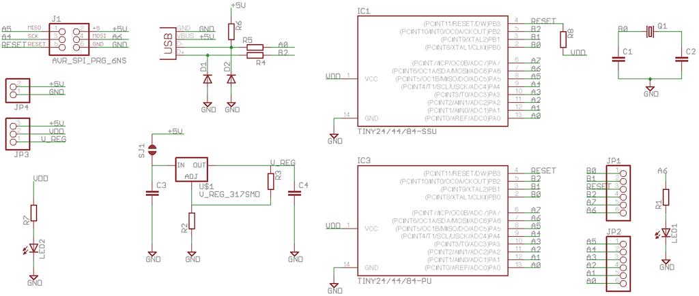
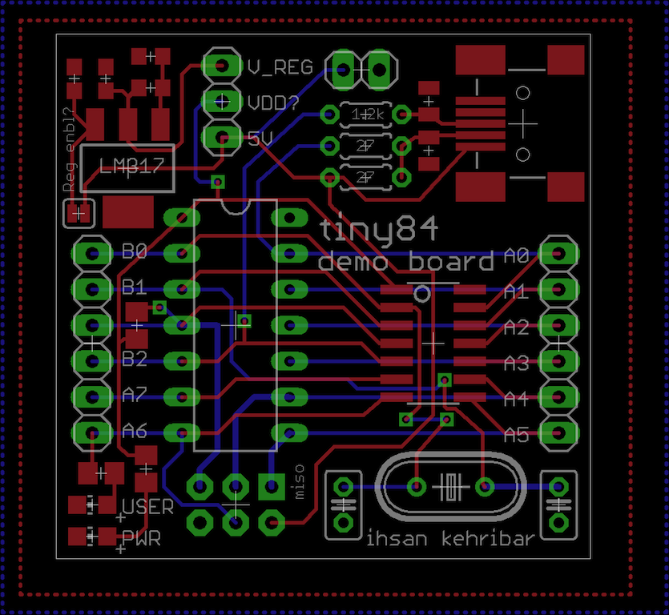
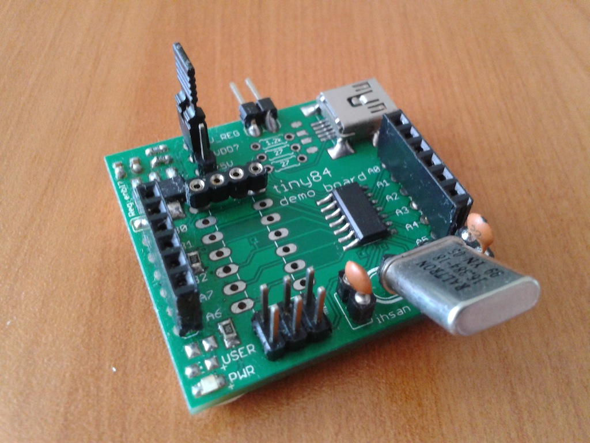

Attiny84 breakout board
================

Basic Attiny84 breakout board. It has footprints for both SMD and through hole chip. Also, the board has USB circuitry to enable VUSB based projects. 

### Schematic

### Layout

### Build

