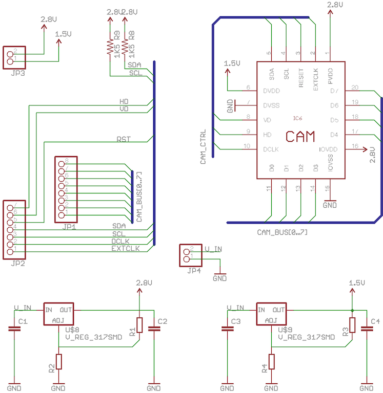
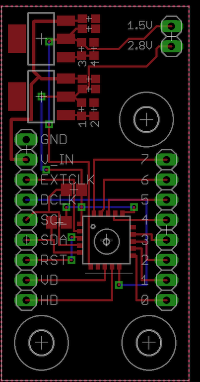
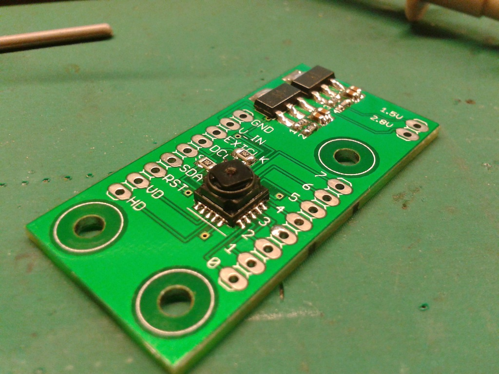

Embedded camera module
================

This was my attempt to create a breakout board for the 10$ CMOS camera chip (TCM8230MD) that Sparkfun sells: [https://www.sparkfun.com/products/8667 ](https://www.sparkfun.com/products/8667)

Footprint for the camera and initial schematic file is coming from this blog post: [http://www.ikalogic.com/image-processing-as-a-sensor/](http://www.ikalogic.com/image-processing-as-a-sensor/)

I've populated this board but never actually managed to get an image out of it ...

### Schematic

### Layout

### Build

