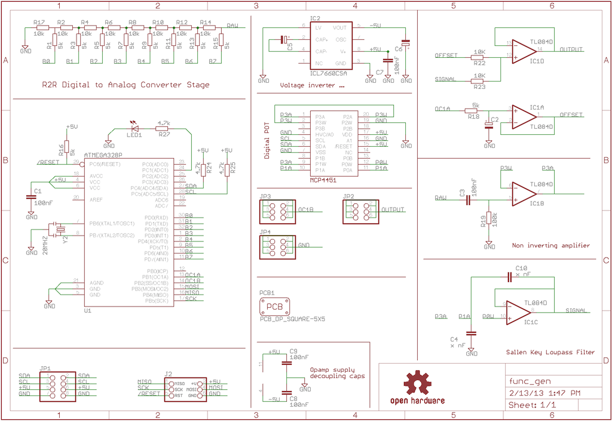
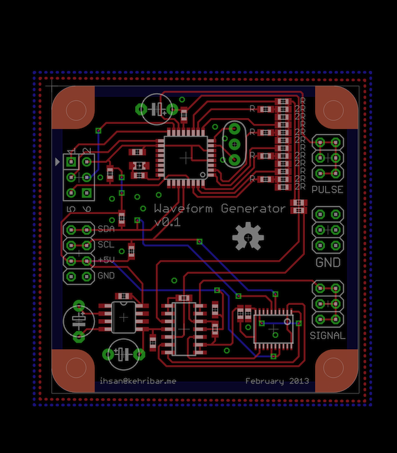
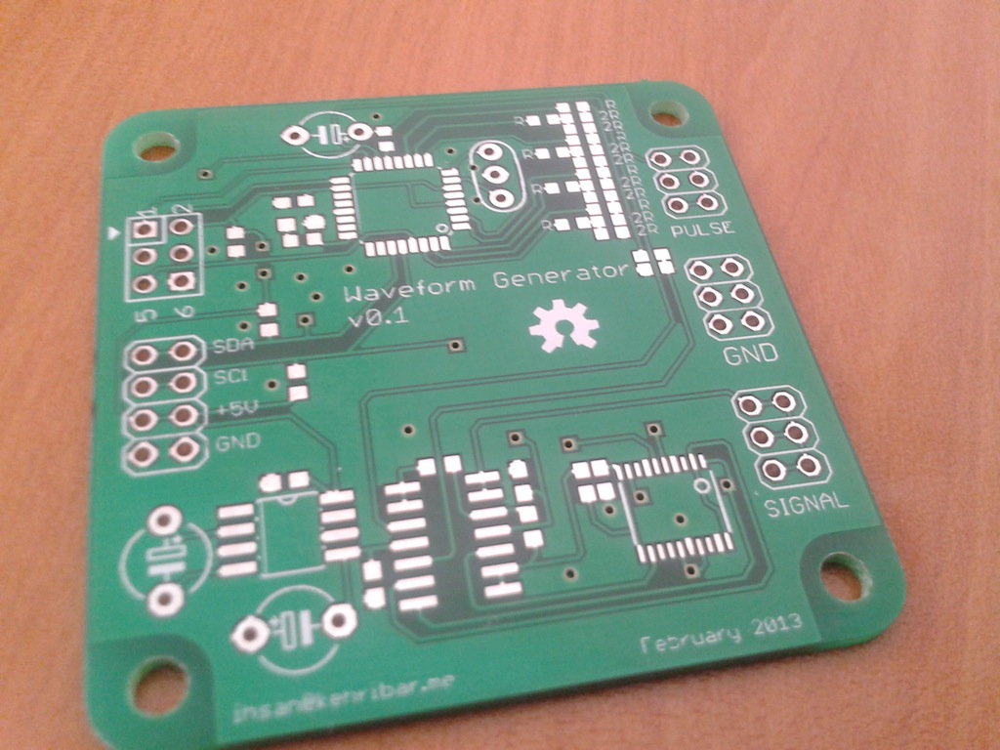

Function generator
================

This is a prototype of a DDS based function generator. By changing its onboard lookup table, this board can be used to generate an arbitrary waveform with an adjustable frequency. I was aiming to interface this board via an USB-I2C interface.

R2R ladder is used to create a very fast DAC stage to generate the waveforms. I've put a frequency adjustable 2nd order Sallen Key low pass filter to clear the harmonics as much as possible when using single frequency sine wave outputs. Also the offset of the output voltage can be adjusted digitally. Lastly, I've routed an hardware PWM output pin to the pulse pinheader which can be usefull as well.

I've ordered parts for this board but haven't populated yet ...

### Schematic

### Layout

### Build

