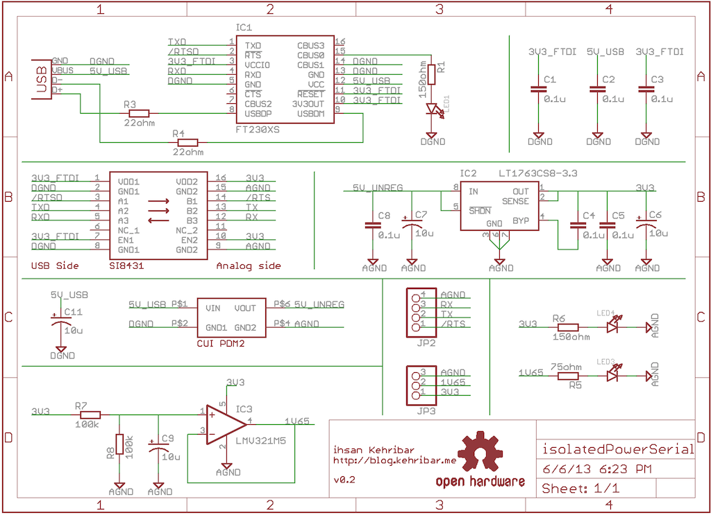
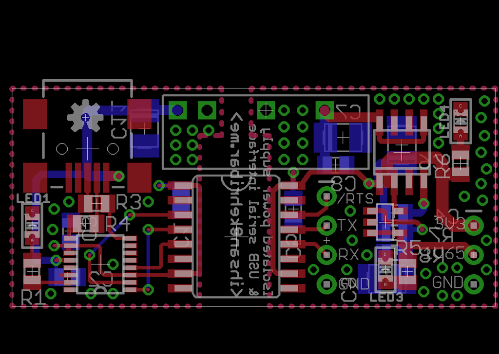
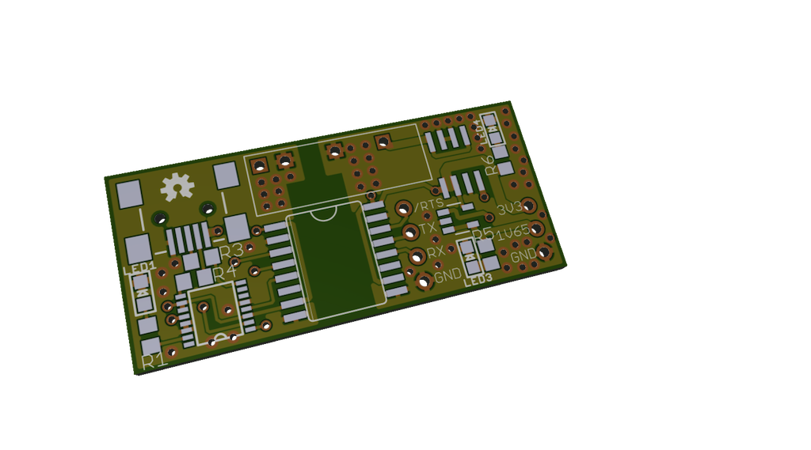
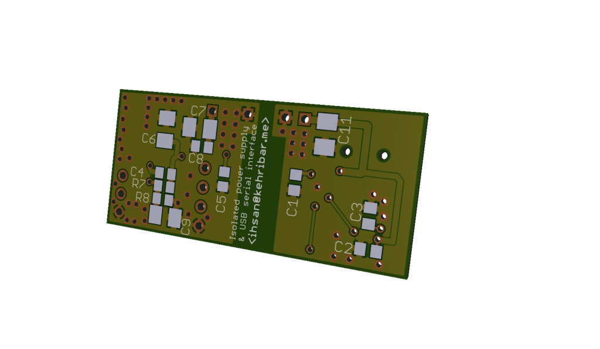

USB based isolated fixed voltage source and serial interface
================

Sometimes I need to send ADC results to the PC for further analysis but also I don't want to inject noise to my measurement system from PC ground. Isolated serial link is perfect for this. Also I used a very low noise LDO - LT1763 - which can be used to supply power to host circuit. Lastly, 1V65 supply can be used as a virtual ground in single supply opamp based circuits.

Most of the design ideas are coming from Dave L. Jone's uSupply board: [http://eevblog.com/files/uSupplyUSBrevB.pdf](http://eevblog.com/files/uSupplyUSBrevB.pdf)

I haven't sent this board to fab yet …

### Schematic

### Layout

### Render

