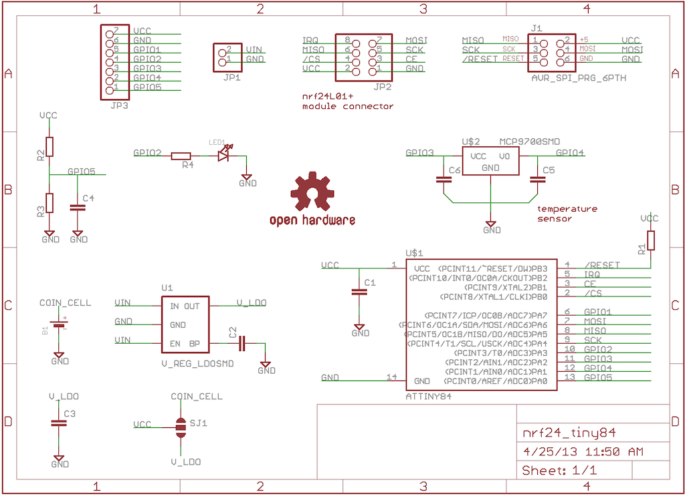
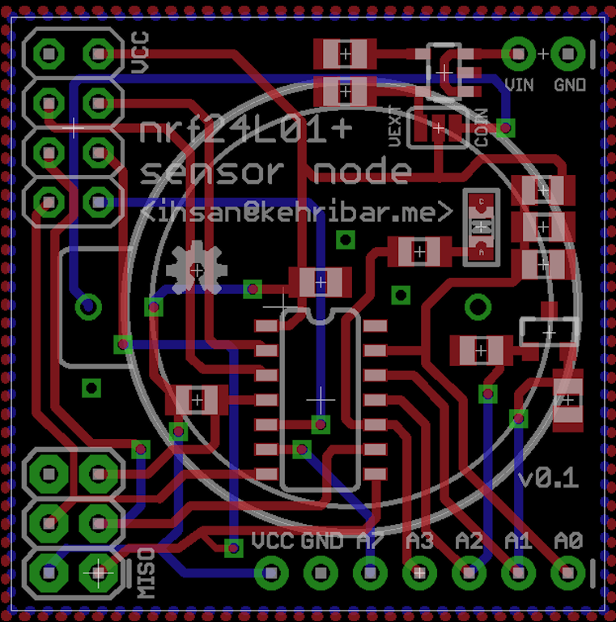
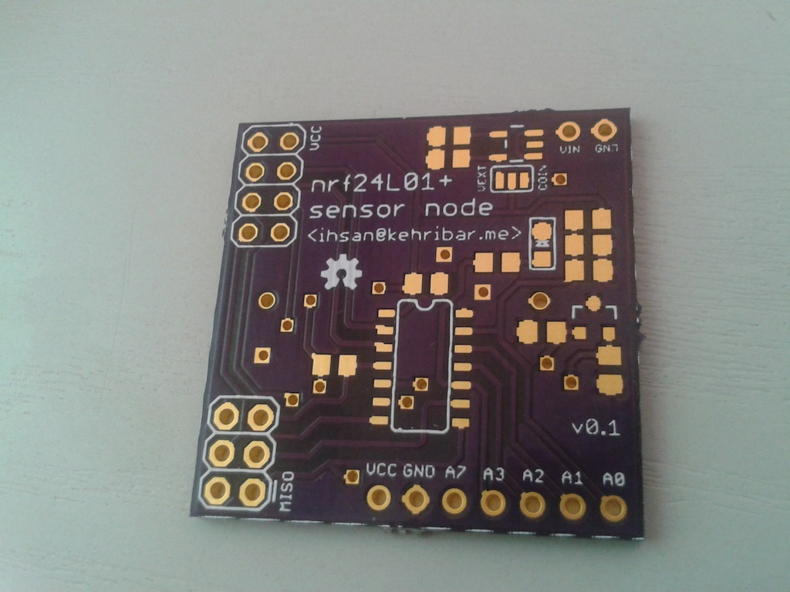
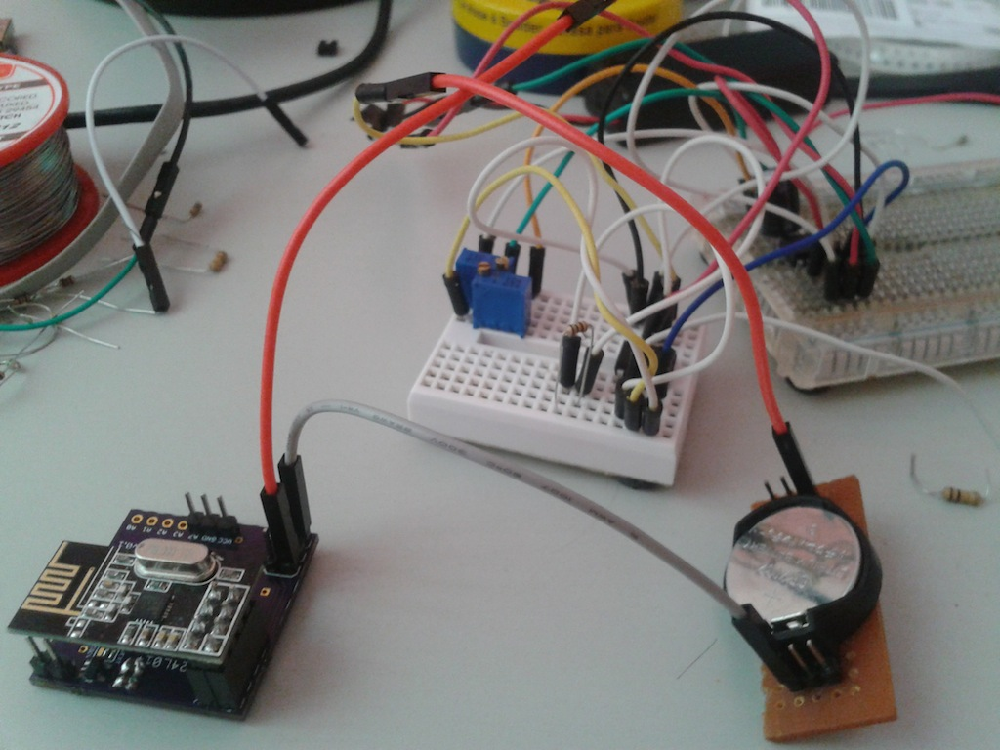

nrf24l01+ node board with Attiny84
================

Sensor node board for nrf24l01+ RF transceiver with Attiny84. Board have an onboard temperature sensor and its power can be switched on/off by a GPIO pin. Also, board can measure its VCC voltage. On-chip bandgap voltage reference of the Attiny84 can be used the compare the battery voltage (attenuated by the voltage divider) with a known VCC independent voltage. Board can be powered by an external power source or coin cell battery. There is also a footprint for user LED for indication purposes.

I also wrote a library to use nrf24l01+ transceiver which is available here: [https://github.com/kehribar/nrf24L01_plus](https://github.com/kehribar/nrf24L01_plus)

This board is featured on the Dangerous Prototypes blog: [http://dangerousprototypes.com/2013/05/03/cr2032-powered-node-board/](http://dangerousprototypes.com/2013/05/03/cr2032-powered-node-board/)

### Schematic

### Layout

### Build

